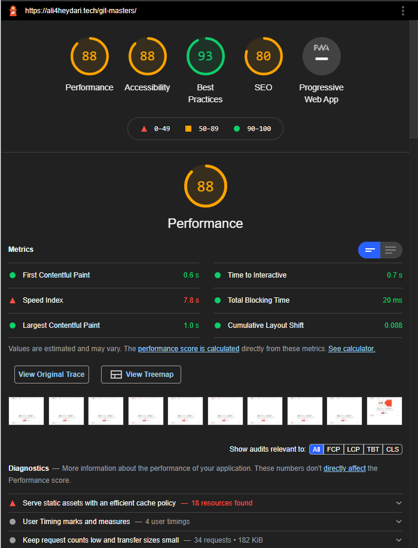

# Git masters

This repository contains the source code of my website for teaching Git course.

---

Git is the world's most popular Version Control System (VCS), It allows you to keep track of your development's history, reverse your code in case of a failure, and collaborate successfully with others.

---

## Lighthouse report

